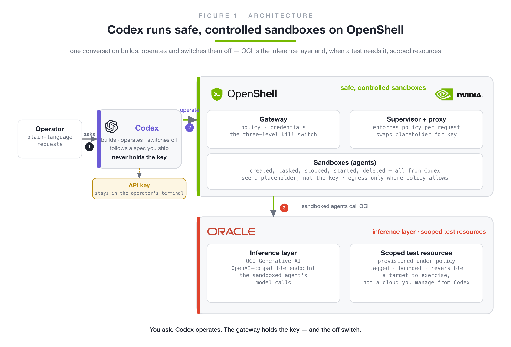

# OpenShell + OCI: an agent kill switch you can run

A runnable demo for [NVIDIA OpenShell](https://github.com/NVIDIA/OpenShell),
the sandbox runtime at the core of NVIDIA's Open Agent Safety Platform
(launched 2026-09-28), with the evidence from every run.

A small agent does real work through **OCI Generative AI** or **OpenRouter**
from inside an OpenShell sandbox. It never holds its API key and cannot reach
anything its policy does not name. The operator then shuts it down from the
gateway in three steps — the whole fleet, one agent's credential, one sandbox —
while a second agent shows which steps are fleet-wide and which are surgical.
The runbook checks all 13 scenes and prints a pass/fail summary.

Companion to the blog post
[An agent kill switch you can run](https://blog.kamelhar.net/an-agent-kill-switch-on-oracle-cloud/).

> **Personal work, personal resources.** Everything here was built and tested
> with my own accounts and machines. The OpenShell contributions are mine, made
> as an individual open-source contributor. This is not an Oracle publication,
> product commitment, or statement of Oracle's plans.

## Build it with Codex

You do not have to learn the OpenShell or OCI command lines to run this demo:
hand the prompt in [`codex/`](codex/) to [OpenAI Codex](https://developers.openai.com/codex)
and it builds, verifies, and cleans up everything below, with the one
key-handling step kept in your own terminal. The spec was adversarially
reviewed by Codex itself and then reproduced blind by fresh sessions — the
transcripts are in [`evidence/`](evidence/).



```shell
codex -c sandbox_workspace_write.network_access=true \
  --add-dir ~/.config/openshell --add-dir ~/.docker \
  "$(cat codex/PROMPT.md)"
```

**Watch it happen:** [the Codex UI operating a sandbox, 78 s](videos/focus2-codex-ui-2x.mp4) ·
[provisioning and reclaiming scoped OCI resources, 105 s](videos/focus3-codex-ui-3x.mp4) ·
[the safety net and the keyless preview, 28 s](videos/focus4.mp4) — all recordings in [`videos/`](videos/).

## Where things are

| You want | Go to |
|---|---|
| Build it with an agent | [`codex/`](codex/) — the spec and prompts Codex follows; [`evidence/`](evidence/) holds the run transcripts |
| Watch it | [`videos/`](videos/) — the real Codex-UI recordings and paced replays |
| Run the demo | [`demo/demo.sh`](demo/demo.sh) — the runbook, `TARGET=oci` or `TARGET=openrouter` |
| The agent | [`demo/agent/agent.py`](demo/agent/agent.py) — standard-library Python, any OpenAI-compatible API |
| What the agent may do | [`demo/profile/`](demo/profile/) — one provider profile per upstream |
| The fleet-wide kill switch | [`demo/policies/lockdown.yaml`](demo/policies/lockdown.yaml) — a policy with no network rules |
| Your own agent in a sandbox | [`examples/`](examples/) — the OpenAI SDK and LangChain (with a tool), unchanged |
| Proof it works | [`demo/evidence/`](demo/evidence/) and [`tests/matrix.sh`](tests/matrix.sh) |
| What was learned | [`docs/insights.md`](docs/insights.md) — control model, timings, gotchas |

## Architecture


The gateway holds the real key and the policy. Each sandbox's supervisor
enforces both and swaps a placeholder for the key on the way out, for the
provider's host only. Which upstream is used is decided by the provider profile
attached — `oci-genai-python` or `openrouter-python` — and nothing else changes.
More figures in [`docs/figures/`](docs/figures/).

## 1. Install OpenShell

**You need:** Linux, macOS on Apple Silicon, or Windows with WSL 2
(experimental), with Docker running (Docker Desktop, or Docker Engine on
Linux). On macOS also install GNU coreutils for bounded timeouts:
`brew install coreutils` (the runbook has a fallback, but coreutils is better).

```shell
curl -LsSf https://raw.githubusercontent.com/NVIDIA/OpenShell/main/install.sh | sh
```

The installer sets up the `openshell` CLI and a local gateway (a user service
on Linux, `brew services` on macOS). The demo was tested on **OpenShell 0.1.2**
and parses the CLI's table output; to install that exact version:

```shell
curl -LsSf https://raw.githubusercontent.com/NVIDIA/OpenShell/main/install.sh | OPENSHELL_VERSION=v0.1.2 sh
```

Check that the gateway is up:

```shell
openshell --version
openshell status          # expect: Status: Connected
```

The demo's evidence step reads the supervisor's log from Docker. If your
gateway picked another runtime, set the compute driver to Docker as described
in [gateway configuration](https://docs.nvidia.com/openshell/latest/how-it-works/gateways/configuration).

## 2. Get the code

```shell
git clone https://github.com/fede-kamel/openshell-oci-kill-switch-demo
cd openshell-oci-kill-switch-demo      # every command below runs from here
```

## 3. Set up a provider

Pick one; you can set up both. The key is stored in the gateway and never
enters a sandbox. It is read from your environment, so it never appears on a
command line or in `ps`; `read -rs` keeps it out of your shell history too.

### OpenRouter (no cloud account needed)

You need an [OpenRouter](https://openrouter.ai) account with a little credit:
the default model, `meta-llama/llama-3.3-70b-instruct`, costs a fraction of a
cent for a whole run (an empty account gets HTTP 402).

```shell
openshell provider profile import --file demo/profile/openrouter-python.yaml --global
read -rs OPENROUTER_API_KEY && export OPENROUTER_API_KEY        # paste the key, press Enter
openshell provider create --name or-demo --type openrouter-python --credential OPENROUTER_API_KEY
unset OPENROUTER_API_KEY
```

### OCI Generative AI

You need an OCI tenancy with Generative AI in your region (the default is
`us-chicago-1`, model `meta.llama-3.3-70b-instruct`) and the
[OCI CLI](https://docs.oracle.com/en-us/iaas/Content/API/Concepts/cliconcepts.htm)
configured. **Create the IAM policy before the key** — a key created first can
stay unauthorized after the policy lands, and OCI returns the same 401 either
way. In the console (Identity → Policies), in the key's compartment:

```text
allow any-user to use generative-ai-family in compartment id <compartment-ocid>
  where ALL {request.principal.type='generativeaiapikey'}
```

Then create a key with an expiry. The `sk-...` secret is shown once:

```shell
oci generative-ai api-key create --compartment-id <compartment-ocid> \
  --region us-chicago-1 --display-name openshell-demo \
  --key-details '[{"keyName":"primary","timeExpiry":"2027-01-01T00:00:00Z"}]'
```

And store it in the gateway:

```shell
openshell provider profile import --file demo/profile/oci-genai-python.yaml --global
read -rs OCI_GENAI_API_KEY && export OCI_GENAI_API_KEY          # paste the key, press Enter
openshell provider create --name oci-genai-demo --type oci-genai-python --credential OCI_GENAI_API_KEY
unset OCI_GENAI_API_KEY
```

In another region, set `OCI_REGION=<region>` when you run the demo.

## 4. Run the demo

```shell
TARGET=openrouter ./demo/demo.sh
TARGET=oci ./demo/demo.sh             # OCI is the default
```

A run takes two to three minutes (longer the first time, while Docker pulls
the image) and ends like this:

```text
== Summary (openrouter) ==
PASS  the agent holds a placeholder, not the key
PASS  a real request succeeds through the proxy
PASS  the allowed request is allowed
PASS  an unlisted host is refused at connect
PASS  a disallowed method gets 403 policy_denied
PASS  lockdown blocks or-agent
PASS  lockdown blocks or-agent-2
PASS  lifting restores or-agent
PASS  lifting restores or-agent-2
PASS  detach blocks or-agent
PASS  detach leaves or-agent-2 working
PASS  stop leaves or-agent Stopped
PASS  stop leaves or-agent-2 Ready
ALL 13 CHECKS PASSED
```

**The runbook changes gateway-wide state, so it is careful.** It refuses to
start if a global policy is already in force, if other sandboxes are running
(the lockdown would cut them off), or if sandboxes with its names exist. On
success, failure, Ctrl-C or a kill signal it lifts its own lockdown, stops the
worker and deletes the sandboxes it created. Options and the scene-by-scene
walkthrough are in [`demo/README.md`](demo/README.md).

## 5. Put your own agent in the sandbox

Nothing in the agent has to know about OpenShell. [`examples/`](examples/)
runs the official **OpenAI Python SDK** and **LangChain with a tool call**,
unchanged, inside a sandbox with the same provider:

```shell
TARGET=openrouter ./examples/run-examples.sh
TARGET=oci ./examples/run-examples.sh
```

The libraries are given `base_url` and an API key variable that holds a
placeholder (`openshell:resolve:env:…`); the proxy swaps in the real key on the
way out. Both examples pass on both providers.

## Results

Every scene passed on both providers, from a fresh clone, on OpenShell 0.1.2
with the Docker driver:

| Scene | OCI Generative AI | OpenRouter |
|---|---|---|
| What the agent sees in its key variable | a placeholder | a placeholder |
| A real request | `HTTP 200` | `HTTP 200` |
| An unlisted host | refused at connect | refused at connect |
| A method the policy does not allow | `403 policy_denied`, naming the binary | same |
| Lock down every sandbox | both blocked in 1–8 s | both blocked in 0–10 s |
| Lift the lockdown | answering again in 1–15 s | answering again in 2–19 s |
| Take the credential from one agent | cut off; the other keeps working | same |
| Stop one sandbox | `Stopped` next to `Ready` | same |
| OpenAI SDK, LangChain + tool (`examples/`) | pass | pass |

In timed trials against an agent making a request every second, a running
agent was refused 7–9 s after a lockdown, and `detach --wait` took 2–7 s to
return, by which point the agent was already cut off
([`docs/insights.md`](docs/insights.md#timed-trials-added-after-the-first-run)).
The evidence is in [`demo/evidence/`](demo/evidence/).

## Troubleshooting

| Message | What to do |
|---|---|
| `ABORT: the gateway is not reachable` | Start it: `openshell status`; on Linux `systemctl --user start openshell-gateway`, on macOS `brew services start nvidia/openshell/openshell` |
| `ABORT: provider '…' does not exist` | Do step 3 for your `TARGET` |
| `ABORT: … already has a global policy in force` | Someone else's lockdown is set. Remove it only if it is yours: `openshell policy delete --global --yes` |
| `ABORT: other sandboxes are running` | Use a gateway you own, or accept that they will be locked down too: `SHARED_GATEWAY_OK=1` |
| `ABORT: sandbox(es) already exist` | `REPLACE=1` deletes them first, or pick names with `SANDBOX=…` |
| `ABORT: the upstream rejected the key (401)` | OCI: the IAM policy must exist before the key — create the policy, then a new key. OpenRouter: check the key |
| HTTP 402 from OpenRouter | Add credit, or use a free model: `AGENT_MODEL=<model>:free` |
| Anything else | The session log is in `demo/out/`. If a run was killed hard (`kill -9`), recover by hand: `openshell policy delete --global --yes` and `openshell sandbox delete <name>` |

## Teardown

```shell
openshell provider delete or-demo
openshell provider delete oci-genai-demo
```

Then revoke or let expire the API keys you created (OCI: `oci generative-ai
api-key set-api-key-state`, or its expiry date).

## Tests

[`tests/matrix.sh`](tests/matrix.sh) runs everything on a gateway you own:
both providers end to end, the macOS-style timeout fallback, a missing
provider, a SIGTERM to the whole process group in the middle of the lockdown
(which must still lift it), and the examples on both providers. After each
case it checks that no global policy, sandbox or worker process is left.

## Repository layout

```
codex/                           build it with a coding agent: spec, prompts, evidence summary
videos/                          recordings: the real Codex UI, replays, the safety-net clip
evidence/                        transcripts behind every claim (incl. keyless 5/5, IAM matrix)
.agents/skills/                  in-repo agent skill for this demo
demo/demo.sh                     the runbook
demo/agent/agent.py              the agent
demo/profile/                    oci-genai-python.yaml, openrouter-python.yaml
demo/policies/lockdown.yaml      the fleet-wide kill switch
demo/evidence/                   logs from every run (see its README)
examples/                        OpenAI SDK and LangChain in a sandbox, with a runner
tests/matrix.sh                  the test matrix
docs/figures/                    architecture, controls, request sequence, kill-switch ladder, OCI transports
docs/insights.md                 control model, timings, gotchas
docs/oci-integration-status.md   the three upstream OCI phases and what is verified
docs/upstream/findings.md        the two bugs found upstream (#3993, #3994), their causes and fixes
docs/oracle-openshell-guide.mdx  a fuller OCI guide
```

## Upstream work this builds on

| Phase | What it gives OpenShell users | Status |
|---|---|---|
| Bearer profile `oci-genai` | OCI Generative AI through the OpenAI-compatible endpoint with an injected API key | merged, [#3904](https://github.com/NVIDIA/OpenShell/pull/3904) |
| Proxy-side request signing `credential_signing: oci` | native OCI APIs with placeholders in the sandbox | open, [#3962](https://github.com/NVIDIA/OpenShell/pull/3962) — previewed live from a branch build: [`evidence/keyless-signing-kubernetes-2026-10-02.log`](evidence/keyless-signing-kubernetes-2026-10-02.log) |
| Gateway-minted principals | no long-lived key anywhere: instance, resource, and OKE workload principals | open draft, [#3975](https://github.com/NVIDIA/OpenShell/pull/3975) |

## License

Apache-2.0. `demo/profile/oci-genai-python.yaml` and
`demo/profile/openrouter-python.yaml` are derived from the `oci-genai` and
`openrouter` example profiles in NVIDIA/OpenShell (Apache-2.0) and keep their
headers; see `NOTICE`.
